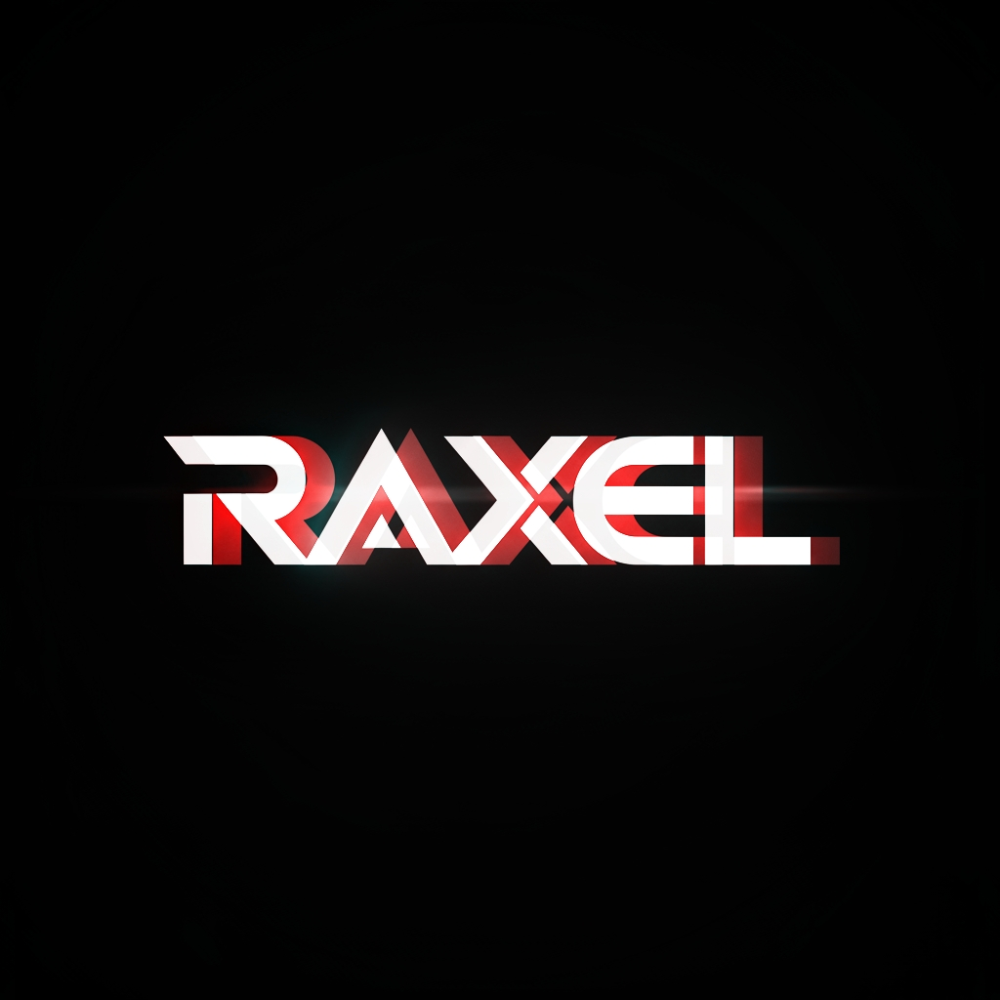

# 🎵 Raxel Music

> **"Where code meets melody."**

🚀 **[Live Demo](https://raxel-music.netlify.app/)**

Welcome to the official web player for **Raxel Music**. This project is a custom-built, immersive audio experience designed to showcase original musical creations. It combines modern web technologies with a passion for sound, delivering a premium listening environment directly in the browser.



## ✨ Features

This isn't just a music player; it's an interactive experience designed for audiophiles and tech enthusiasts.

### 🎧 Immersive Audio & Visuals
*   **Web Audio API Engine**: Built on the native Web Audio API for high-fidelity playback and real-time frequency analysis.
*   **Dynamic Visualizer**: A custom-coded waveform visualizer that reacts instantly to every beat and frequency change, creating a mesmerizing visual sync.
*   **Thematic Experience**: Switch between stunning, mood-based themes including *Cyberpunk*, *Ocean*, *Sunset*, and *Forest*.

### 🛠️ Smart Controls & Utilities
*   **Keyboard Shortcuts**: Control playback without touching the mouse:
    *   `Space`: Play / Pause
    *   `Arrow Right / Left`: Next / Previous Track
    *   `Arrow Up / Down`: Volume Control
*   **Sleep Timer**: Set a timer to automatically stop playback, perfect for late-night listening.
*   **Playlist Management**: Filter songs by category or view your **Favorites**. Favorites are persisted locally so you never lose your top picks.
*   **Toast Notifications**: Non-intrusive feedback for actions like shuffling, repeating, or liking a song.

### 🔒 Security & Performance
*   **Content Protection**: Features advanced audio encryption (XOR) and in-memory decryption. Audio sources are converted to Blob URLs, obscuring the direct file paths.
*   **UI Protection**: Disables right-click and drag-and-drop to protect visual assets.
*   **Fully Responsive**: A seamless "app-like" feel on both desktop and mobile devices, with touch-optimized controls and a collapsible playlist drawer.

## 🛠️ Tech Stack

Built with performance, aesthetics, and modern standards in mind:

*   **Frontend**: [React 19](https://react.dev/) + [Vite](https://vitejs.dev/)
*   **Styling**: Modern CSS3 with CSS Variables, Glassmorphism, and Responsive Design.
*   **Animations**: [Framer Motion](https://www.framer.com/motion/) for buttery smooth transitions and layout animations.
*   **Icons**: [Lucide React](https://lucide.dev/).
*   **Backend**: Node.js + [Express](https://expressjs.com/) (for serving and potential API extensions).
*   **Real-time**: [Socket.io](https://socket.io/) integration.

## 🚀 Getting Started

Want to run this locally?

1.  **Clone the repository**
    ```bash
    git clone https://github.com/Rex1671/Raxel-Music.git
    ```

2.  **Install dependencies**
    ```bash
    cd Raxel-Music
    npm install
    ```

3.  **Run the development server**
    To run both the backend server and the frontend client concurrently:
    ```bash
    npm run dev:full
    ```
    *Or for frontend only:* `npm run dev`

## 👨‍🎤 About the Artist

All songs featured in this player are original compositions by **Raxel** with some of my amazing friends. This platform serves as the primary digital stage for our musical journey.

---

*© 2025 Raxel Music. All rights reserved.*
